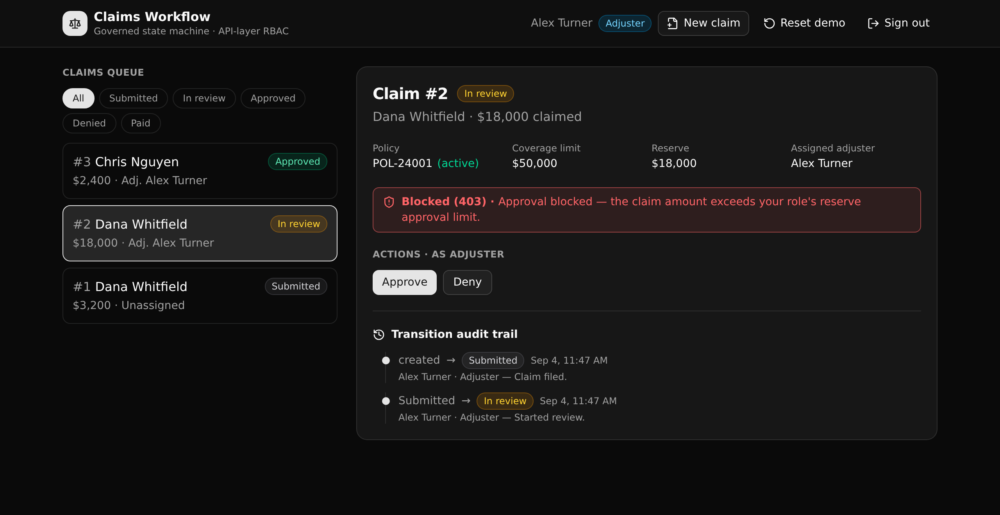

# Claims Workflow State Machine

A governed insurance claims backend. Each claim moves through an enforced state machine, illegal transitions and over-limit approvals are blocked at the API layer, and every move is written to a readable audit trail.

**5 tables · 9 API endpoints · 3 API groups**



## What it demonstrates

This is a Play 2 (Backend Modernization) template for insurance. It stands in for the legacy claims stack a carrier runs today (the data, the APIs, the workflow rules, and the roles) in one governed backend, so a platform director can see how the old monolith modernizes piece by piece.

The one governed job: move a claim through an enforced state machine where every transition checks real rules and every move is recorded. It shows four things a technical evaluator cares about:

- **Real relationships.** Policies, claims, an immutable audit log, per-role reserve limits, and an auth table, wired with foreign keys.
- **API-layer RBAC (not row-level security).** An auth-table token carries the caller role, and each endpoint checks it with a precondition. Permissions live in the API layer, never in a row-level policy.
- **A readable state machine.** One endpoint is the engine. It checks the legal edge, then the caller role, then the reserve limit, in that order, and the first failure returns a 403 that names the rule.
- **A trigger-quality audit log.** Every move (and every assignment) appends one row. The claim detail renders the ordered trail with who did what and when.

## The state machine

```
submitted ─▶ in_review ─▶ approved ─▶ paid
     │            │
     └────────────┴─▶ denied
```

Three guards run in order on every transition, and the first to fail wins:

1. **Legal edge.** The target is an allowed next state for the current state. Jumping `submitted` straight to `paid` is refused.
2. **Role.** A claims manager may perform any legal move. An adjuster may do anything except mark a claim paid. A viewer is read-only.
3. **Reserve limit.** An approval is allowed only when the claim amount is at or under the caller role's approval cap. An adjuster is capped lower than a manager, so a large claim an adjuster cannot approve goes through once a manager signs in.

## Repo layout

```
xano/
  index.ts                 the workspace, registering everything below
  tables/                  users (auth), policies, claims, claim_transitions, reserve_limits
  api/
    groups.ts              the three API groups (pinned canonical slugs)
    login.ts               authenticate, mint a role-bearing token
    file.ts                file a claim (policy active, amount within coverage)
    transition.ts          the state-machine engine (the three guards)
    assign.ts              assign an adjuster (manager only)
    get.ts                 one claim joined to policy, adjuster, and audit trail
    list.ts                the queue view, filterable by state
    policies.ts            policies for the file form
    adjusters.ts           assignable adjuster directory
    seed.ts                reset and reseed the demo fixture
  xano.lock                generated identity lock (committed)
frontend/
  src/lib/api.ts           the one contract: paths and types from the query defs
  src/lib/claims.ts        client-side view of the state machine
  src/components/          SignIn, Queue, ClaimDetail, FileClaim, and the shadcn ui
docs/                      this repo's landing page and screenshot
```

## API surface

The canonical slug on each group is namespaced with the app id (`cwsm`) so it stays unique on a shared instance.

| Method | Path | What it enforces |
| --- | --- | --- |
| POST | `/api:cwsm_auth/login` | Verifies the credentials, mints a Bearer token that carries the role. |
| POST | `/api:cwsm_claims/file` | Authenticated. Policy must be active, amount within the coverage limit. Writes the first audit row. |
| POST | `/api:cwsm_claims/transition` | Legal edge, then role, then reserve limit. On pass, updates the state and appends an audit row. |
| POST | `/api:cwsm_claims/assign` | Claims manager only. The assignee must have the adjuster role. |
| GET | `/api:cwsm_claims/get/{claim_id}` | One claim joined to its policy, its adjuster, and its full ordered audit trail. |
| GET | `/api:cwsm_claims/list` | The queue view, optionally filtered by state. |
| GET | `/api:cwsm_claims/policies` | Every policy, for the file-a-claim form. |
| GET | `/api:cwsm_claims/adjusters` | The assignable adjuster directory. |
| POST | `/api:cwsm_seed/reset` | Public. Truncates and reseeds a small, coherent fixture. |

The frontend never hand-types a URL or a request body. `frontend/src/lib/api.ts` derives every path from the query def (`getPath()`) and every request and response type from the def (`InferInput` / `InferResponse`), so a change to a backend def surfaces as a type error in the client.

## Quick start

```bash
git clone https://github.com/xano-scratch/claims-workflow-state-machine
cd claims-workflow-state-machine
npm install
npx xanots login          # authenticate with Xano, once
npm run xano:deploy        # builds the frontend, deploys both, prints the live URL
```

The deploy is a full replace, so the tables start empty. Populate the demo in either way:

- Open the app and sign in as one of the demo accounts. If the tables are empty, the first sign-in seeds them.
- Or call the public seed endpoint: `POST /api:cwsm_seed/reset`.

Demo accounts all use the password `demo1234`: `manager@demo.test` (claims manager), `adjuster@demo.test` and `adjuster2@demo.test` (adjusters), `viewer@demo.test` (viewer).

## Try the governed flow

1. Sign in as `adjuster@demo.test`. Open claim #2 and click **Approve**. It is blocked: the amount is over the adjuster reserve limit, and the API returns a 403 that names the rule.
2. Sign in as `manager@demo.test` and approve the same claim. It goes through.
3. Open claim #1 as the adjuster and walk it `submitted` to `in review` to `approved`. Try to mark it paid: the API refuses, because only a manager may mark a claim paid.
4. Read the audit trail on any claim. Every move is there, with the actor and the time.

## FAQ

**Is this row-level security?** No. Permissions are enforced at the API layer (RBAC). The login endpoint mints a token that carries the role, and each guarded endpoint checks the role with a precondition. There is no row-level policy anywhere.

**How are approval limits enforced?** A `reserve_limits` row maps each role to its approval cap. The transition endpoint reads the caller role from the database, looks up the cap, and blocks an approval above it.

**Where is the audit log?** Every transition and every assignment appends one row to `claim_transitions`. That table is only ever appended to. The claim detail endpoint returns the ordered history, enriched with each actor's name and role.

**Can I reset the data?** Yes. Call `POST /api:cwsm_seed/reset`, or click **Reset demo** in the app. A redeploy also resets it, because a deploy is a full replace.

## About

Built with [XanoTS](https://www.npmjs.com/package/@xanots/sdk) (`@xanots/sdk`): a typed Xano backend authored in TypeScript, plus a React, Vite, Tailwind, and shadcn/ui frontend. `xano.lock` is committed so object identities stay stable across renames and redeploys. MIT licensed.
